# GUDAM

 

# Build & Deploy Document

## Preface:
This project is built on a microservices architecture, where each service operates within its own **isolated environment**. Each service runs in a container with its own dedicated resources and can communicate exclusively with other services within the network.
The team behind this project has placed special emphasis on scalability. This project is built using Kubernetes, a container orchestrator that allocates resources to each service. These resource allocations can dynamically adjust in the future based on the specific needs of each service.
***
### Architecture:

**Architecural diagram:**
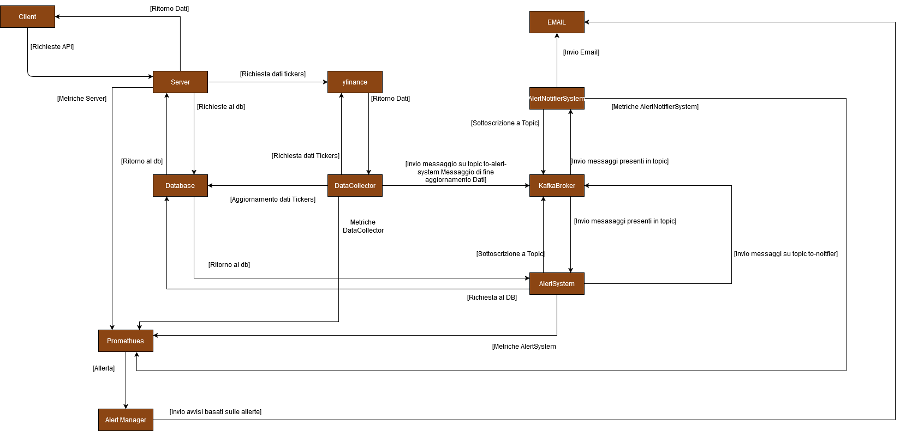
The diagram illustrates the microservice architecture of the project. It highlights the interaction between various components:

* Client communicates with the Server to request data via APIs.
* The Server interacts with the Database and external APIs (like yfinance) to fetch and update data.
* The DataCollector component gathers data, updates the database, and sends status messages to KafkaBroker.
* KafkaBroker facilitates communication between AlertSystem and AlertNotifierSystem, which manage and notify alerts via emails.
* Prometheus monitors system metrics, and the AlertManager sends alerts based on pre-defined rules.

Each service is self-contained and communicates through defined interfaces, ensuring scalability and fault tolerance.

The CQRS pattern is used to have a better mangament of the database's requests.
 

**Sequence diagrams:**
PingServer:
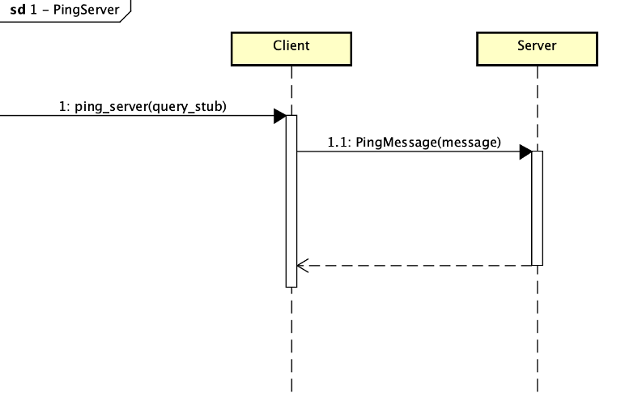  
The interaction begins when the Client invokes the `ping_server` method using a query stub. The Client then sends a `PingMessage`, which includes a parameter named `message`, to the Server. The Server processes this request and responds to the Client with a confirmation or a corresponding result. The communication is completed when the Client receives the response from the Server, concluding the ping operation. If the Server is down, the Client shows a negative access message.
 

Login:
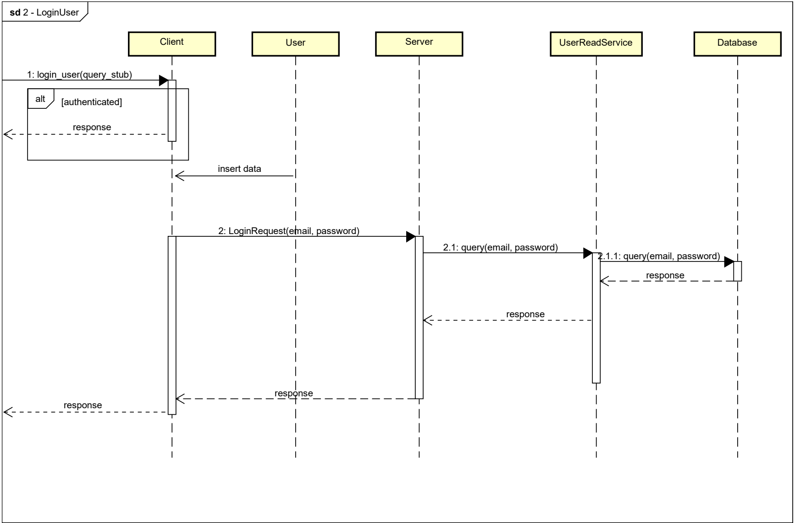
 The interaction begins when the Client invokes the login_user method with a query stub. If the user is already authenticated, an alternative response is immediately returned to the client. Otherwise, the client proceeds by sending a LoginRequest, containing the user's email and password, to the Server. The server forwards this request to the UserReadService, which queries the user's credentials in the Database. The database processes the query and returns the result to the UserReadService, which then passes it back to the Server. Finally, the server sends the appropriate response to the client, completing the login process. 
 

 CreateUser:
 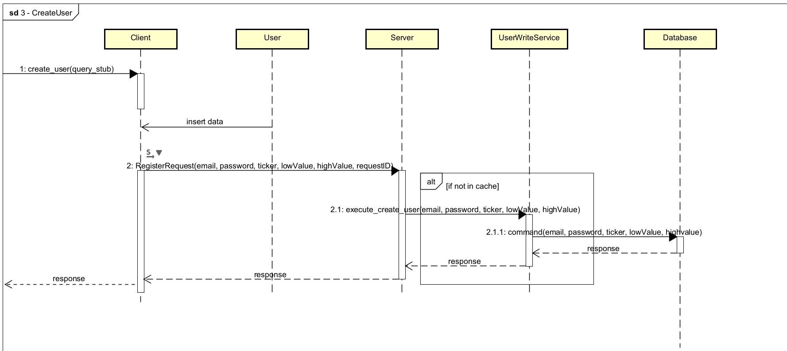
 The interaction begins when the Client sends a create_user request using a query stub. The client then provides user data, including email, password, ticker, lowValue, highValue, and requestID, which are encapsulated in a RegisterRequest sent to the Server.

The Server processes this request by invoking the execute_create_user method in the UserWriteService. If the requested data is not found in the cache, the UserWriteService sends a command to the Database, containing the user's information. The database processes the command, stores the data, and returns a response to the UserWriteService, which in turn sends it back to the Server.

Finally, the Server returns the result of the operation to the Client, completing the registration process.
 

UpdateUser:
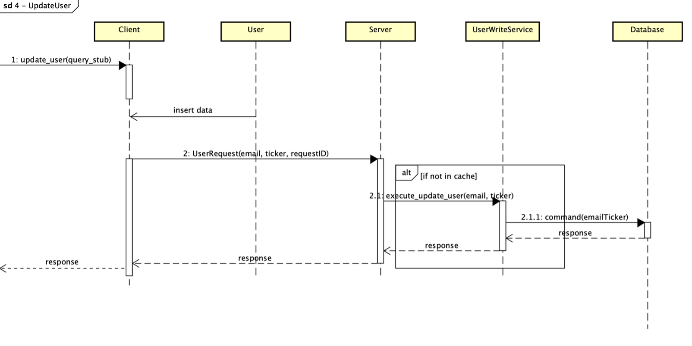
The interaction begins when the Client invokes the update_user method using a query stub. The Client inserts the data, including the email, ticker, and requestID, and sends a UserRequest to the Server.

The Server processes this request by invoking the execute_update_user method in the UserWriteService. If the required data is not found in the cache, the UserWriteService sends a command, encapsulating the emailTicker, to the Database. The Database processes the command, updates the relevant data, and sends a response back to the UserWriteService.

The UserWriteService forwards the response to the Server, which in turn sends it back to the Client, completing the update operation.
 

ModifyHighLow:
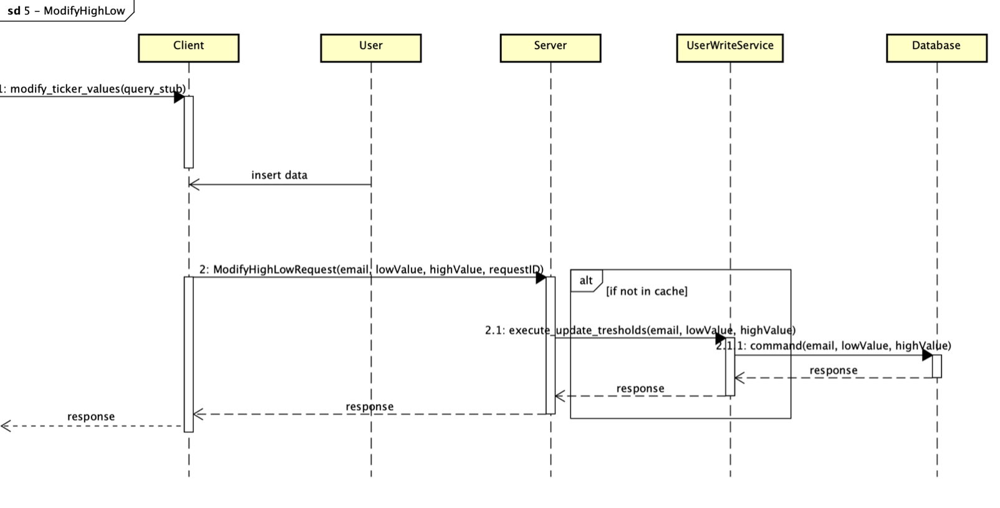
The sequence begins with the Client invoking the modify_ticker_values method using a query stub. The Client sends the data, including email, lowValue, highValue, and requestID, and triggers a ModifyHighLowRequest to the Server.

Upon receiving the request, the Server calls the execute_update_thresholds method in the UserWriteService. If the required data is not found in the cache, the UserWriteService sends a command containing email, lowValue, and highValue to the Database. The Database processes the command, updates the respective thresholds, and returns a response to the UserWriteService.

The UserWriteService then forwards the response back to the Server, which sends it to the Client, completing the threshold modification process.
 

DeleteUser:
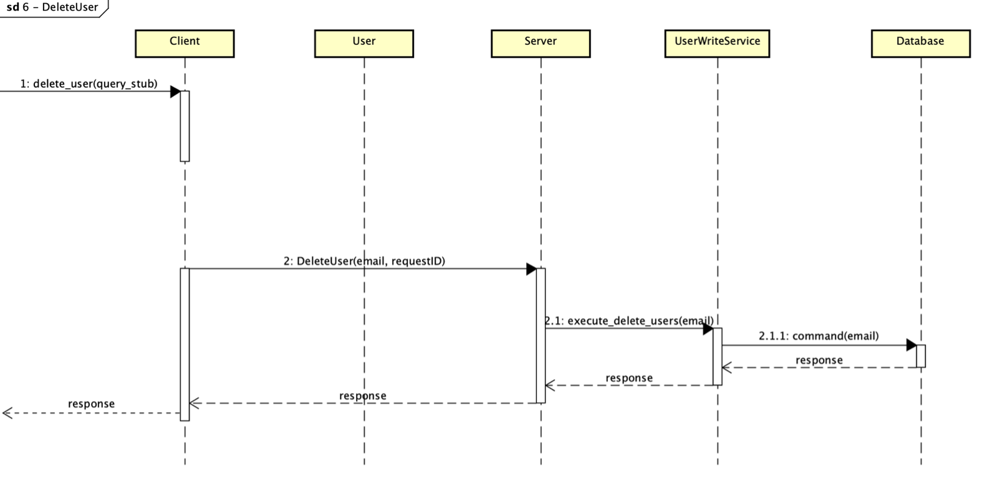
The process begins with the Client invoking the method delete_user using a query stub. The client, send the data, including the email of the current user.

When the Serverer receives the request, if is not already in the requests cache, it calls the method execute_delete_user by passing the email of the user, which executes the command with the UserWriteService and updates the database.

The user is then logged out and his data are cleared from the database.
 

GetTicker:
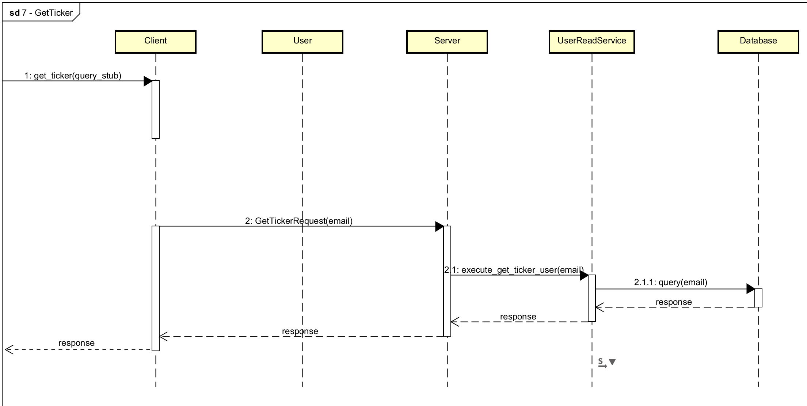
The interaction starts when the Client sends a get_ticker request using a query stub. The request is passed to the Server, which processes it by invoking the execute_get_ticker_user method in the UserReadService.

The UserReadService then queries the Database with the user's email to retrieve the corresponding ticker information. The Database processes the query and returns the result to the UserReadService, which forwards it back to the Server. Finally, the server sends the ticker information as a response to the Client, completing the operation.
 

GetAvaragePrice:
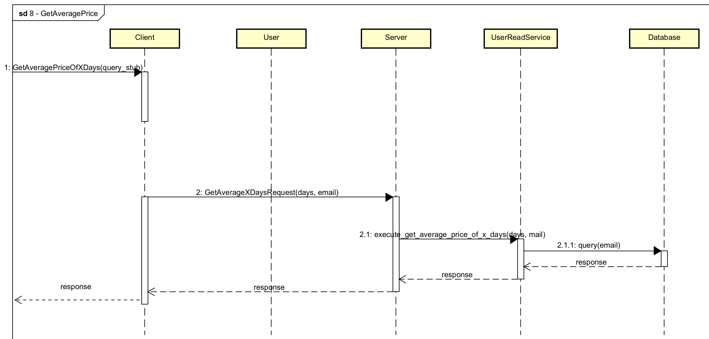
The process begins when the Client sends a GetAveragePriceOfXDays request using a query stub. The client provides the number of days and the user's email as parameters in the request, which is then forwarded to the Server.

The Server processes the request by invoking the execute_get_average_price_of_x_days method in the UserReadService. The UserReadService queries the Database with the user's email and the specified time frame to calculate the average price. The Database processes the query and returns the computed result to the UserReadService, which then forwards it back to the Server. Finally, the Server sends the response containing the average price to the Client, completing the operation.
 

GetThresholds:

This function is used from the user to retrieve his ticker's thresholds.

The client invokes the method get_thresholds with a query stub. The email of the current user is passed to request, which gets sent.

The query is then executed from the UserReadService, which invokes the method execute_get_thresholds and gets them in the database. Those thresholds are then returned to the user.
 

DataCollector:
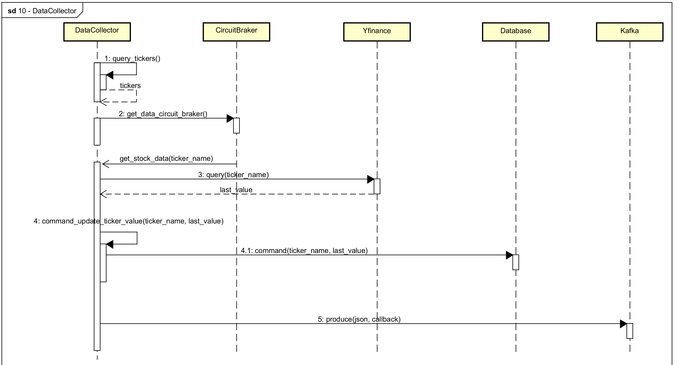
The process begins when the DataCollector invokes the query_tickers method to retrieve a list of tickers. For each ticker, the DataCollector calls the get_data_circuit_braker method to interact with the CircuitBreaker.

The CircuitBreaker then requests stock data from the Yfinance service via the get_stock_data method, passing the ticker name as a parameter. Yfinance responds with the latest value for the ticker, which is returned to the DataCollector.

Once the DataCollector receives the latest ticker value, it issues the command_update_ticker_value method to update the database. This involves calling the command method to store the ticker name and its latest value in the Database.

Finally, the DataCollector sends a produce request to Kafka, including a JSON payload and a callback, to propagate the updated data to other components of the system.
 

AlertSystem:
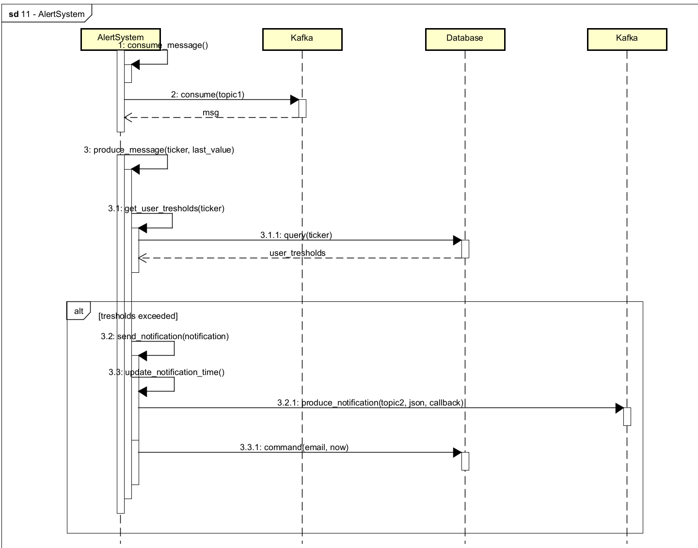
The process begins when the AlertSystem consumes a message from Kafka using the consume_message method. This triggers a consume call on a specific topic (topic1), retrieving a message containing ticker and last value information.

The AlertSystem then produces a message containing the ticker and its latest value and fetches user-specific thresholds by invoking the get_user_thresholds method. This involves querying the Database for the thresholds associated with the ticker.

If the retrieved data indicates that the thresholds are exceeded, the alternative flow is triggered. The AlertSystem proceeds to send a notification to the user by invoking the send_notification method. It also updates the notification time in the database by calling update_notification_time. This involves producing a notification message to a new Kafka topic (topic2) with a JSON payload and callback, and subsequently issuing a command to store the updated notification time in the Database. Inside the message produced from the topic, there is the email of the user to be notified and the eventual condition, if the value is lower or higher than his thresholds. The norification is then consumed from the AlertNotifierSystem.

This process ensures timely alerts are sent to users while maintaining an updated record of notifications.
 

ALertNotifierSystem:
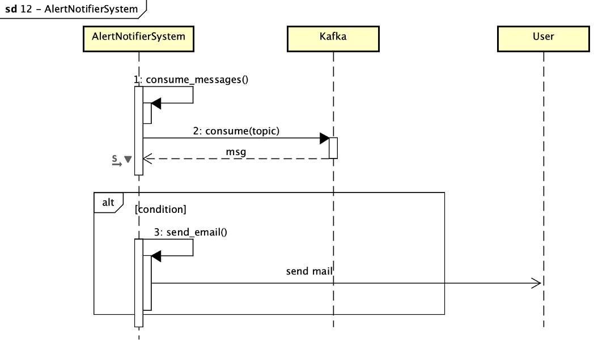
The AlertNotifierSystems is the one that sends an email to the user, advising him that the ticker value has exceeded the thresholds.

The AlertNotifierSystem consumes the message in the topic, afeter subscribing to it, and gets the message. Then, it creates an email message, if the condition is present, and sends it to the user, which the email is retrieved from the consumed message.
***

### Prometheus monitored metrics
The metrics exposed from each microservise, implementing a Whitebox Monitoring, are useful to understand how the system is responding and to expose it's quality and efficieny of the system; however, the metrics are useful to think and take action to solve eventual problems.

The metrics are:
- Server:
    - s_request_counter: number of requests arriving to the server.
    - s_user_counter: number of active users (clients connetted to the server).
    - s_request_latency_seconds: latency of each request in different moments. The are organized into an histogram, which could be better analyzed using Grafana.
    - s_errors_counter: number of bad requests.

- DataCollector:
    - dc_tickers_count: numbers of tickers red from the database.
    - dc_messages_produced_count: numbers of produced messages.
    - dc_ticker_update_latency: latency of ticker updates, organized into an histogram.
    - dc_failed_ticker_updates: numbers of failed updates.
    - dc_circuit_breaker_open: numbers of time the CB is opened.

- AlertSystem:
    - as_messages_processing_time: time to process messages.
    - as_messages_consumed_count: numbers of consumed messages.
    - as_messages_produced_count: numbers of produced messages.

- AlertNotifierSystem:
    - ans_email_processing_time: time to process email sending.
    - ans_sent_emails_count: numer of sent emails.
***

## Before you start:
#### Disclaimer:
**This steps are to make a cluster and try it locally. If you want to use this configuration on your servers you may change several files.
Before you start make sure you have docker installed and running on your machine.**

First of all, you need to clone this repo: `git clone https://github.com/stopflunky/GUDAM`

You need 2 essential tools: kubectl and minikube
Let's start with kubectl:
* For windows you need to type: `curl.exe -LO "https://dl.k8s.io/release/v1.32.0/bin/windows/amd64/kubectl.exe"`
 

* For Linux you need to type: `curl -LO "https://dl.k8s.io/release/$(curl -L -s https://dl.k8s.io/release/stable.txt)/bin/linux/amd64/kubectl"`
 

* For Mac(m series) you need to type:`curl -LO "https://dl.k8s.io/release/$(curl -L -s https://dl.k8s.io/release/stable.txt)/bin/darwin/arm64/kubectl"` 
 

Let's continue installing minikube: 
* Windows: `winget install Kubernetes.minikube`
 

* Linux:
    * `curl -LO https://github.com/kubernetes/minikube/releases/latest/download/minikube-linux-amd64`
    * `sudo install minikube-linux-amd64 /usr/local/bin/minikube && rm minikube-linux-amd64`
 

* Mac (m series):
    * `curl -LO https://github.com/kubernetes/minikube/releases/latest/download/minikube-darwin-arm64`
    * `sudo install minikube-darwin-arm64 /usr/local/bin/minikube`

 

If you have any dubts on the installation part please check the official installation pages of minikube or kubectl.

***

## Build Part

Open a terminal and go to GUDAM, then you need to build your cluster:
`minikube start`

Once minikube has started:
`kubectl apply -f /manifest`

You need to create manually a config map for the database configuration:
`kubectl create configmap db-init-sql --from-file=./database/DB.sql`

At that point all the services was created, if you want to see all the services please type: `kubectl get pod`

Don't worry if several services don't running at first time. You need to insert at minimum one record in the database for obtaining a correct state for all services. The AlertNotifierSystem, especially, is the one that could initially not be running. This is becaus it initially can't find a topic if a message from the AlertSystem is not produced, which means that no user has exceeding values.
 

#### Running the client:
Please expose 50051 of the service with the comand:`kubectl port-forward svc/grpc-server-service 50051:50051`
Now open another client and start client.py
***

## Focus on Prometheus
If you want to enter on Prometheus dashboard, first of all you need you expose port 9090 of prometheus service
use the command:`kubectl port-forward service/prometheus-service 9090:9090`

After that open your brower and type on the url bar: localhost:9090
