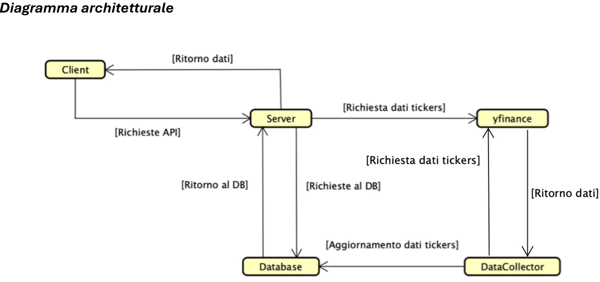

# GUDAM

 

# Build & Deploy Document

## prerequisites:

* Docker: latest
* Python: latest 
* grpcio: 1.68.0 or *higher*
* grpcio-tools: 1.67.1 or *higher*
* protobuf: 5.28.3 or *higher*
* yfinance: 0.2.49 or *higher*
* psycopb2-binary: 2.9.10 or *higher*
* python-dateutil: 2.9.0 or *higher*

      

 

## In your terminal:

**Optional:**

Before start you can create a python virtual envirorment with the command:

`python -m venv VirtualEnvirormentName` for Windows

`python3 -m venv VirtualEnvirormentName` for Mac or Linux

Now to activate the virtual envirorment, if you are in VsCode type the following in your terminal:

`.\VirtualEnvirormentName\Scripts\activate` for Windows

`source VirtualEnvirormentName/bin/activate` for Mac or Linux

 
 
 

**Mandatory Part:**

go in the GUDAM directory:
`cd yourpath/GUDAM`

Run
`docker-compose up`

After that you can test your server.
you need to run the client.py file in the GUDAM directory

By typing in your terminal (if you have Windows): `python client.py`

If you have Unix-like OS (linux or mac-os) you need to type: `python3 client.py`

